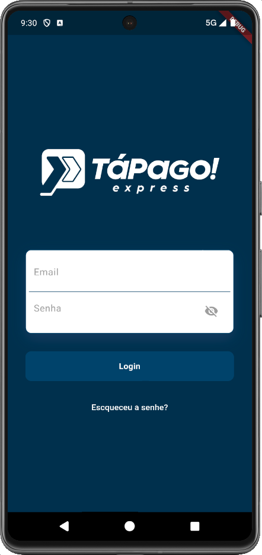
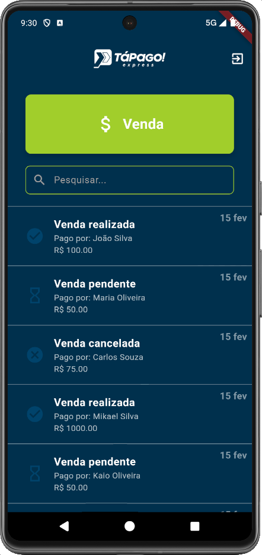
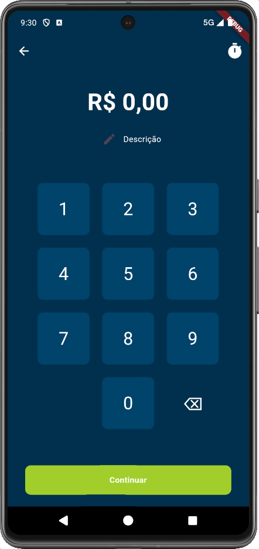
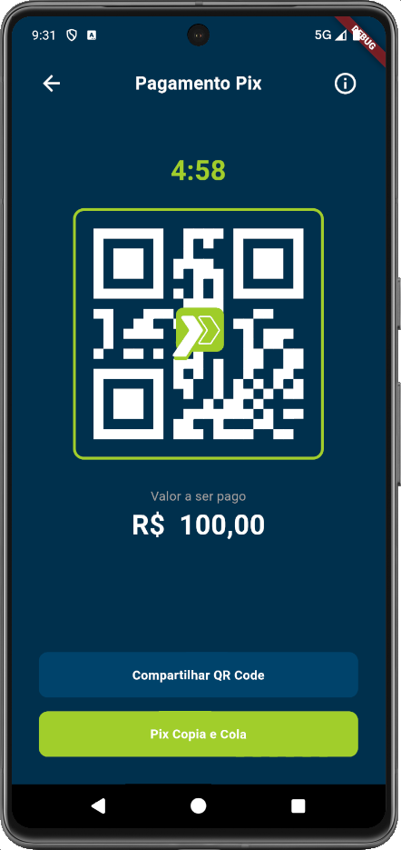
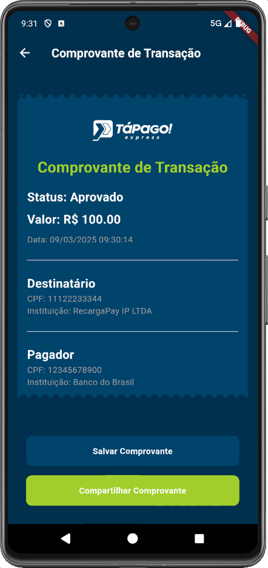
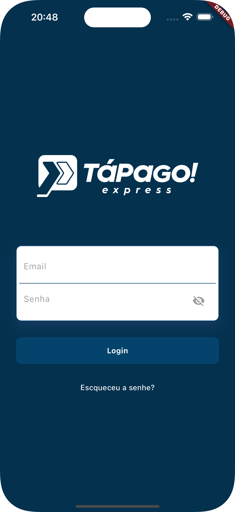
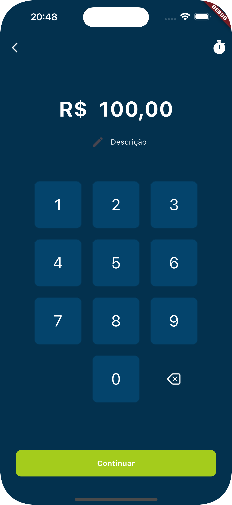
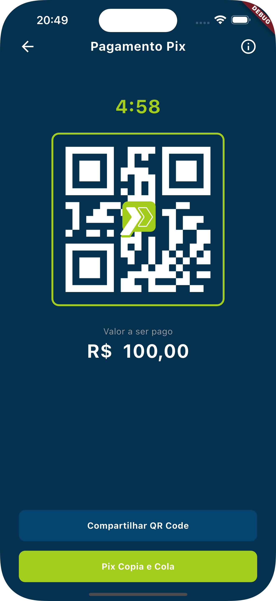
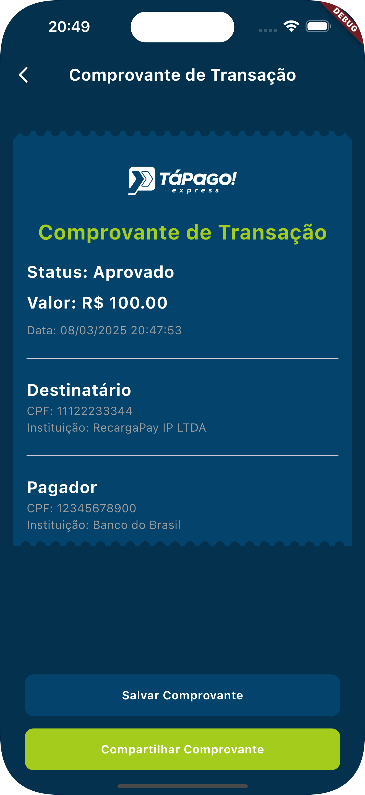

# Tá na Conta

O **Tá na Conta** é um sistema de vendas via Pix que utiliza QR Codes para facilitar transações. Desenvolvido em Flutter com o GetX para gerenciamento de estado, o aplicativo oferece uma experiência fluida e reativa, abrangendo desde o login até a criação e monitoramento de transações via Pix.

---

## Descrição do Projeto

O projeto possibilita que o usuário:
- Realize login com segurança.
- Acesse uma tela inicial que exibe o extrato de transações.
- Crie QR Codes Pix por meio de uma interface intuitiva, que conta com:
  - Teclado numérico para inserção do valor.
  - Seleção do tempo de expiração.
  - Campo para adicionar uma descrição à transação.
- Visualize o QR Code gerado em uma tela dedicada, que também apresenta:
  - Um timer de expiração.
  - Botões para compartilhar o código, com opção de copiar para a área de transferência.
- Receba notificações quando o pagamento é realizado dentro do prazo, atualizando automaticamente o estado da transação.

---

## Funcionalidades

- **Autenticação:** Tela de login para acesso seguro ao sistema.
- **Extrato de Transações:** Tela inicial com o histórico e status das operações realizadas.
- **Geração de QR Code Pix:** Criação dinâmica de QR Code com personalização de valor, expiração e descrição.
- **Notificações e Monitoramento:** Atualização do status da transação e notificação imediata sobre o pagamento.
- **Compartilhamento:** Funcionalidade para compartilhar o QR Code, facilitando a divulgação dos dados de pagamento.

---

## Tecnologias e Dependências

O projeto foi desenvolvido utilizando **Flutter** para a construção de uma interface moderna e responsiva, aliado ao **GetX** para gerenciamento de estado e navegação eficiente. A seguir, um resumo das principais dependências e suas versões utilizadas:

- **cupertino_icons (v1.0.8):** Ícones padrão do iOS para dar uma identidade visual mais próxima dos dispositivos Apple.
- **get (v4.6.6):** Gerenciamento de estado, injeção de dependências e navegação.
- **animate_do (v4.0.1):** Animações simples e eficazes para enriquecer a experiência do usuário.
- **flutter_native_splash (v2.4.4):** Criação de splash screens nativas para um carregamento inicial mais agradável.
- **qr_flutter (v4.1.0):** Geração e exibição de QR Codes.
- **intl (v0.20.2):** Suporte para internacionalização e formatação de datas e números.
- **connectivity_plus (v6.1.3):** Monitoramento da conectividade do dispositivo.
- **flutter_shake_animated (v0.0.5):** Efeitos visuais para feedbacks de erro, como em formulários de login.
- **shared_preferences (v2.5.2):** Armazenamento local de informações simples.
- **dotted_border (v2.1.0):** Criação de bordas pontilhadas para componentes visuais.
- **sks_ticket_view (v1.0.0):** Visualização customizada de tickets e comprovantes.
- **pdf (v3.11.3) e printing (v5.14.2):** Geração e impressão de documentos.
- **time_picker_sheet:** Dependência obtida via Git para a seleção de horários, facilitando a escolha do tempo de expiração do QR Code.

---

## Estrutura do Projeto

A organização do projeto é modular, facilitando a manutenção e a escalabilidade. Veja abaixo uma visão geral da estrutura do diretório:

```
lib/
├─ app/
│  ├─ data/
│  │  ├─ app_assets.dart
│  │  ├─ app_storage_keys.dart
│  │  └─ app_strings.dart
│  ├─ exceptions/
│  │  └─ app_exceptions.dart
│  ├─ models/
│  │  └─ paymment_model.dart
│  ├─ modules/
│  │  ├─ home/
│  │  │  ├─ bindings/
│  │  │  │  └─ home_binding.dart
│  │  │  ├─ controllers/
│  │  │  │  └─ home_controller.dart
│  │  │  └─ views/
│  │  │     ├─ home_view.dart
│  │  │     └─ paymment_recipient_screen.dart
│  │  ├─ login/
│  │  │  ├─ bindings/
│  │  │  │  └─ login_binding.dart
│  │  │  ├─ controllers/
│  │  │  │  └─ login_controller.dart
│  │  │  ├─ views/
│  │  │  │  └─ login_view.dart
│  │  │  └─ widgets/
│  │  │     ├─ shake_widget.dart
│  │  │     ├─ shakeable_login_form.dart
│  │  │     └─ v_painter.dart
│  │  └─ payments/
│  │     ├─ bindings/
│  │     │  └─ payments_binding.dart
│  │     ├─ controllers/
│  │     │  └─ payments_controller.dart
│  │     └─ views/
│  │        ├─ payments_view.dart
│  │        └─ qr_code_view.dart
│  ├─ routes/
│  │  ├─ app_pages.dart
│  │  └─ app_routes.dart
│  ├─ services/
│  │  └─ connectivity_service.dart
│  └─ theme/
│     ├─ app_buttons.dart
│     ├─ app_colors.dart
│     ├─ app_decorations.dart
│     ├─ app_text_styles.dart
│     └─ app_theme.dart
└─ main.dart
```

---

## Instalação e Execução

### Pré-requisitos

- Flutter instalado e devidamente configurado.
- Ambiente preparado para desenvolvimento Android e/ou iOS.

### Passos para Execução

1. **Clone o Repositório:**
   - Utilize o comando:
     ```
     git clone <URL_DO_REPOSITÓRIO>
     cd ta_na_conta
     ```

2. **Instale as Dependências:**
   - Execute:
     ```
     flutter pub get
     ```

3. **Rode o Projeto:**
   - Para **Android**:
     ```
     flutter run
     ```
   - Para **iOS**:
     ```
     flutter run --flavor ios
     ```

---

## Screenshots

### Android
<!-- Adicione aqui os screenshots do app rodando em Android -->
<p align="center">
  
  
  
  
  
</p>


### iOS
<!-- Adicione aqui os screenshots do app rodando em iOS -->
<p align="center">
  
  
  
  
  
</p>


---

## Contribuição

Contribuições são bem-vindas! Para colaborar:

1. Faça um fork do repositório.
2. Crie uma branch para sua feature:
   ```
   git checkout -b minha-feature
   ```
3. Realize as alterações e efetue um commit:
   ```
   git commit -m 'Adiciona nova feature'
   ```
4. Envie sua branch para o repositório remoto:
   ```
   git push origin minha-feature
   ```
5. Abra um Pull Request.

---

## Licença

Este projeto está licenciado sob a [MIT License](LICENSE).

---

## Contato

Caso tenha dúvidas ou sugestões, sinta-se à vontade para abrir uma _issue_ ou entrar em contato.
